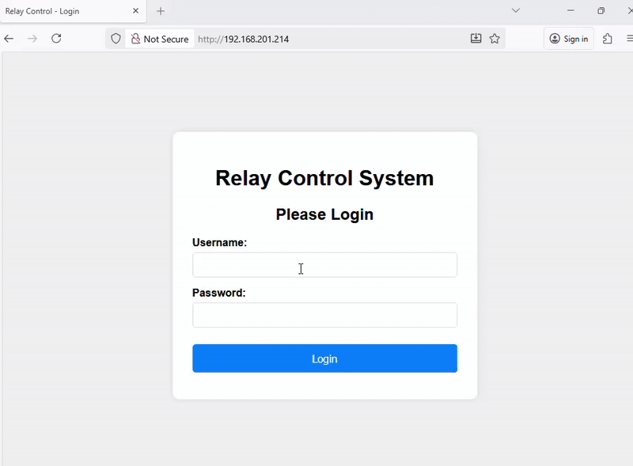

# Home Automation Relay Server with ESP8266

A versatile and robust home automation relay server built using the ESP8266 microcontroller. This project provides a flexible solution for controlling electrical appliances remotely through a web interface, operating in two distinct modes: Access Point (AP) and Station (Client) mode.





## 🚀 Features

- **Dual Operation Mode**: 
  - **Access Point Mode**: Creates its own WiFi network for direct connection
  - **Station Mode**: Connects to your existing home WiFi network
- **Web-Based Control**: Intuitive web interface for relay control
- **Multiple Relay Support**: Control multiple relays simultaneously
- **Secure Operation**: Basic authentication protection
- **Responsive Design**: Works on desktop and mobile devices
- **Real-time Status**: Live feedback of relay states(coming soon)
- **RESTful API**: Programmatic control via HTTP endpoints(coming soon)
- **OTA Updates**: Over-the-air firmware updates(coming soon)
- **persistent webinterface**:saves the information for monitoring in EEPROM (coming soon)

## 📋 Prerequisites

### Hardware Requirements
- ESP8266 NodeMCU
- Relay modules (1-channel or 4-channel)
- Jumper wires
- Breadboard (optional)
- 5V Power supply
- Electrical wiring components (for appliance integration)

### Software Requirements
- Arduino IDE or PlatformIO
- ESP8266 Board Package
- Required Libraries (listed in dependencies)

## 🔧 Installation & Setup

### Hardware Connections

| ESP8266 Pin | Relay Module | Description |
|-------------|--------------|-------------|
| D1          | IN1          | Relay 1 Control |
| D2          | IN2          | Relay 2 Control |
| D3          | IN3          | Relay 3 Control |
| D4          | IN4          | Relay 4 Control |
| 3.3V        | VCC          | Power       |
| GND         | GND          | Ground      |

### Software Installation

1. **Clone the Repository**
   ```bash
   git clone https://github.com/pakoti/awesome-smart-home
   cd awesome-smart-home
   ```

2. **Install Dependencies**
                           
   - Using Arduino IDE:
     - Install the following libraries through Library Manager:
       - ESP8266WiFi
       - ESP8266WebServer
       - ESP8266mDNS
       - ArduinoJson
       - WiFiManager (optional)

3. **Configuration**
   Edit the `config.h` file to customize settings:
   ```cpp
   // WiFi Credentials (for Station Mode)
   #define STA_SSID "Your_WiFi_SSID"
   #define STA_PASSWORD "Your_WiFi_Password"
   
   // AP Mode Settings
   #define AP_SSID "Relay_Controller"
   #define AP_PASSWORD "12345678"
   
   // Web Server Settings
   #define SERVER_PORT 80
   #define OTA_PORT 8266
   
   // Relay Pins
   #define RELAY_1 D1
   #define RELAY_2 D2
   #define RELAY_3 D3
   #define RELAY_4 D4
   ```

## 🎮 Operation Modes

### Access Point (AP) Mode
- ESP8266 creates its own WiFi network
- Connect directly to "Relay_Controller" network
- Default IP: `192.168.4.1`
- Perfect for standalone operation or initial setup

### Station (Client) Mode
- ESP8266 connects to your existing WiFi
- Access via assigned IP address
- Check serial monitor for IP address
- Ideal for integration with home network

## 🌐 Web Interface

### Accessing the Interface
1. **AP Mode**: Connect to `Relay_Controller` WiFi and navigate to `http://192.168.4.1`
2. **Station Mode**: Find the IP in serial monitor and navigate to `http://[IP_ADDRESS]`

### Interface Features
- **Dashboard**: Overview of all relay states
- **Individual Control**: Toggle each relay independently
- **Group Control**: Control multiple relays simultaneously
- **Status Indicators**: Visual feedback for relay states
- **Mode Switch**: Toggle between AP and Station modes
- **Settings**: Configuration options

## 🔌 API Endpoints

### Control Endpoints
| Endpoint | Method | Description | Parameters |
|----------|--------|-------------|------------|
| `/` | GET | Web interface | - |
| `/api/relay/[1-4]` | GET | Get relay status | - |
| `/api/relay/[1-4]` | POST | Control relay | `state=on/off` |
| `/api/relays` | GET | Get all relay status | - |
| `/api/relays` | POST | Control multiple relays | `relay1=on/off&relay2=on/off...` |
| `/api/mode` | GET | Get operation mode | - |
| `/api/mode` | POST | Change operation mode | `mode=ap/station` |

### Example API Usage
```bash
# Turn on Relay 1
curl -X POST http://192.168.4.1/api/relay/1 -d "state=on"

# Get status of all relays
curl http://192.168.4.1/api/relays

# Switch to Station mode
curl -X POST http://192.168.4.1/api/mode -d "mode=station"
```

## 📱 Mobile App Integration

The server provides a RESTful API that can be easily integrated with:
- Home Assistant
- IFTTT
- Custom mobile apps
- Voice assistants (Alexa, Google Assistant)
- MQTT clients

## 🔒 Security Features

- Basic HTTP authentication
- special password for Doors                                                   
- Configurable access credentials
- Network isolation in AP mode
- Secure OTA updates

## 🛠️ Advanced Configuration

### Customizing Relay Behavior
Edit the `RelayController.h` file to modify:
- Default relay states
- Timing controls
- Safety features
- Logging behavior

### Adding More Relays
1. Update pin definitions in `config.h`
2. Modify web interface in `web_interface.h`
3. Extend API endpoints in `server_routes.h`

## 🐛 Troubleshooting

### Common Issues

1. **ESP8266 not connecting to WiFi**
   - Check STA_SSID and STA_PASSWORD
   - Verify WiFi signal strength
   - Check router MAC filtering

2. **Web interface not accessible**
   - Verify IP address in serial monitor
   - Check firewall settings
   - Ensure correct port (default: 80)

3. **Relays not responding**
   - Verify wiring connections
   - Check power supply to relays
   - Confirm GPIO pin assignments

4. **OTA update failing**
   - Ensure stable WiFi connection
   - Verify sufficient flash memory
   - Check upload speed settings

### Serial Debugging
Enable debug output by setting `DEBUG_ENABLED` to `true` in `config.h`:
```
[INFO] Starting Relay Server...
[INFO] Mode: Access Point
[INFO] AP SSID: Relay_Controller
[INFO] IP Address: 192.168.4.1
[INFO] Web server started on port 80
```

## 📈 Future Enhancements

- [ ] MQTT support for IoT integration
- [ ] WebSocket for real-time updates
- [ ] Scheduled operations
- [ ] Energy monitoring
- [ ] Temperature sensor integration
- [ ] Voice control compatibility
- [ ] Mobile app development
- [ ] Dangerous Gas Detection


## 🤝 Contributing

We welcome contributions! Please feel free to submit pull requests, report bugs, or suggest new features.

1. Fork the repository
2. Create your feature branch (`git checkout -b feature/AmazingFeature`)
3. Commit your changes (`git commit -m 'Add some AmazingFeature'`)
4. Push to the branch (`git push origin feature/AmazingFeature`)
5. Open a Pull Request

## 📄 License

This project is licensed under the MIT License - see the [LICENSE.md](LICENSE.md) file for details.

## 🙏 Acknowledgments

- ESP8266 community for extensive documentation
- Arduino community for continuous support
- Contributors and testers

## 📞 Support

If you encounter any issues or have questions:
1. Check the [Troubleshooting](#troubleshooting) section
2. Search existing [GitHub Issues](https://github.com/pakoti/awesome-smart-home)
3. Create a new issue with detailed information

## 🏷️ Version History

- **v1.0.0** (2024-10-23)
  - Initial release
  - Basic relay control
  - Dual mode operation
  - Web interface

---

**⭐ If you find this project helpful, please give it a star on GitHub!**

---

*Disclaimer: Always exercise caution when working with electrical components. Ensure proper insulation and follow local electrical safety regulations.*